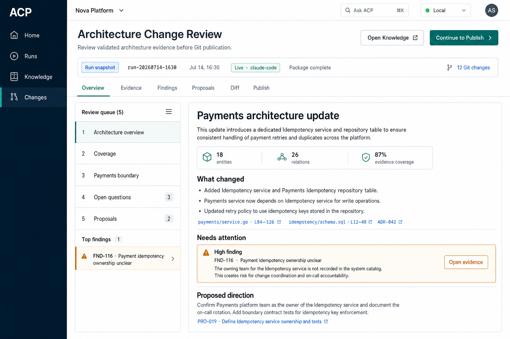

# ProvenArch

[](LICENSE)
[](https://github.com/GrinRus/ProvenArch/releases)
[](https://github.com/GrinRus/ProvenArch/actions/workflows/backend.yml)
[](https://github.com/GrinRus/ProvenArch/actions/workflows/ui.yml)

**Local-first, evidence-backed architecture knowledge for real codebases.**

ProvenArch ships as `acp`, a local Architecture Control Plane with a Go orchestrator and an
embedded React UI. Point it at one or more repositories and optional imported documents; it builds
a separate, Git-reviewable architecture workspace from the evidence it can verify.

The result is not a chat transcript or a standalone diagram. It is a set of ordinary files:
architecture overviews, service and dependency models, evidence links, diagrams, coverage gaps,
findings, open questions, and change proposals. You can inspect, diff, commit, and evolve them with
the same Git workflow you use for code.

> **Project status:** beta, pre-v1 foundation. Public APIs, CLI behavior, and artifact contracts may
> change before `v1.0.0`. ProvenArch is intended for local evaluation and controlled operator use.
> This README describes the current `main` branch; check the
> [release notes](https://github.com/GrinRus/ProvenArch/releases) for the exact contents of a
> published binary.



_Product UI design reference with representative data; this is not a live analysis result._

## Why ProvenArch

Architecture knowledge is usually split across source code, deployment manifests, CI configuration,
documents, and people's memory. Static diagrams drift, while one-off AI conversations are difficult
to review or keep current.

ProvenArch treats architecture as a versioned knowledge base:

- **Local-first:** the service, UI, orchestration, and architecture workspace run on your machine.
- **Evidence-backed:** repository observations are linked to concrete repository paths; missing
  evidence becomes an explicit gap instead of a guessed fact.
- **Git-reviewable:** promoted knowledge is stored as Markdown, YAML, JSON, and Mermaid files in a
  dedicated workspace.
- **Provider-flexible:** use a deterministic `fake` runtime for the first walkthrough and required
  CI, or opt into a supported local AI CLI for live analysis.
- **Reviewable changes:** inspect run-scoped evidence and Git diffs before explicitly committing or
  branching the workspace.

ProvenArch is designed for tech leads, staff and principal engineers, architects, and platform teams
working with systems whose architecture spans one or many repositories.

## What it produces

A successful analysis can produce:

- an Architecture Home at `reports/as-is/overview.md`;
- service, domain, integration, datastore, CI/CD, and ownership views;
- a derived entity-and-relationship model under `model/`;
- evidence-linked Mermaid diagrams under `reports/diagrams/`;
- coverage gaps, findings, open questions, and architect summaries;
- proposal and changelog packages for follow-up work;
- retained run history, logs, indexes, and audit artifacts under `reports/taskruns/`;
- evidence-backed Q&A over the current workspace through the local UI.

The exact output depends on the available evidence. ProvenArch does not promise complete dependency
discovery or invent missing ownership, interfaces, or infrastructure.

## How it works

```text
source repositories + imported documents
                  |
                  v
        local ACP orchestrator
                  |
                  v
      fake or headless runtime CLI
                  |
                  v
        run-scoped staged artifacts
                  |
                  v
       contracts + validator checks
                  |
                  v
     Git-versioned architecture workspace
```

The core pipeline is:

1. Build or update a project charter with scope, domains, constraints, NFRs, and rules.
2. Collect repository evidence into independently validated shard packages.
3. Assemble the as-is Architecture Home, coverage report, and derived model.
4. Validate citations, identities, findings, and the final artifact graph.
5. Promote validator-approved artifacts and prepare proposal packages.
6. Review the result in `Home`, `Runs`, `Knowledge`, and `Changes`, then publish through an explicit
   Git action.

Runtime drafts stay in run-scoped staging directories. Stable workspace paths are updated only after
their contract and validator gates pass. A later `refresh` records source revisions and explains
whether it performed a no-op, selective, or full execution.

## Quick start

The release installer supports macOS and Linux on `amd64` and `arm64`:

```bash
curl -fsSL https://raw.githubusercontent.com/GrinRus/ProvenArch/main/install.sh | sh
export PATH="$HOME/.local/bin:$PATH"
acp version
```

Start the local UI:

```bash
acp serve
```

Open [http://127.0.0.1:8080](http://127.0.0.1:8080), then:

1. Create or open a dedicated architecture workspace.
2. Add one or more local Git checkout paths or Git URLs.
3. Save a short analysis brief.
4. Keep the default `fake` runner.
5. Review readiness and start the first analysis.

The `fake` runtime makes no external AI calls. It produces deterministic synthetic baseline
artifacts and verifies installation, workspace setup, the UI, pipeline wiring, validators, and
publication, but **does not perform live architecture analysis**.

See the [installation guide](docs/INSTALL.md) for manual release installation, checksum
verification, command overrides, and source-build prerequisites.

## Live analysis providers

Live analysis is opt-in and uses a separately installed headless provider CLI:

| Provider ID | Resolved command | Role |
| --- | --- | --- |
| `claude-code` | `ACP_CLAUDE_CMD`, then `claude`, then legacy `claude-code` | Default live provider fallback |
| `qwen-code` | `qwen` or `ACP_QWEN_CMD` | Optional live provider |
| `codex-code` | `codex` or `ACP_CODEX_CMD` | Supported live provider and release peer |

After creating a workspace, check the repository, local provider executable, and runtime
configuration before a live run:

```bash
acp doctor \
  --workspace "$HOME/acp-workspaces/my-service" \
  --repo-path "$HOME/src/my-service" \
  --runtime headless \
  --runtime-provider claude-code

acp serve \
  --workspace "$HOME/acp-workspaces/my-service" \
  --runtime headless \
  --runtime-provider claude-code
```

`doctor` verifies local configuration and executable discovery. It cannot guarantee provider
authentication, quota, API availability, or model compatibility; confirm those through the
provider CLI as well.

Provider selection can also be configured per pipeline step in `workspace.yaml`. See the
[workspace specification](docs/spec/WORKSPACE_SPEC.md) for precedence and runtime profile options.

## CLI and CI usage

The same binary can run without the UI:

```bash
acp init-workspace \
  --workspace "$HOME/acp-workspaces/my-service" \
  --repo-name my-service \
  --repo-path "$HOME/src/my-service"

acp doctor \
  --workspace "$HOME/acp-workspaces/my-service" \
  --repo-path "$HOME/src/my-service" \
  --runtime fake

acp run \
  --workspace "$HOME/acp-workspaces/my-service" \
  --pipeline init \
  --runtime fake \
  --non-interactive
```

Replace `--repo-path` with `--repo-git-url https://github.com/org/my-service.git` to let ACP resolve
the source through the local `git` command and your existing Git credentials.

`acp run --non-interactive` is the supported integration surface for GitHub Actions, GitLab CI, and
other user-managed jobs. ProvenArch does not include a public webhook listener or a hosted control
plane.

## Workspace layout

ProvenArch writes architecture state to a dedicated workspace, not to the analyzed repositories:

```text
arch-workspace/
  workspace.yaml
  charter/
  skills/
  docs/imports/
  model/
    entities/
    edges/
  reports/
    as-is/
    coverage/
    findings/
    diagrams/
    agent-outputs/
    changelog/
    taskruns/
  proposals/
```

Repositories can be local checkout paths or GitHub/GitLab-style Git URLs. Optional imported
documents are copied into the configured `docs.imports_path`; automatic Confluence, Jira, Notion,
or similar connectors are outside the current MVP.

## Runtime trust and data handling

Source repositories are intended to be read-only inputs, and ACP's own outputs go to the separate
architecture workspace. Live analysis nevertheless launches an external provider CLI on the same
machine:

- the default `trusted_full_access` mode passes that provider its full-access flags;
- opt-in `managed` mode narrows automatic approvals to the runtime task envelope;
- managed mode is a policy boundary, not a hard process sandbox;
- the provider's network behavior and data handling follow that provider's CLI and configuration;
- a runtime write audit fails an otherwise successful step when protected workspace surfaces or an
  analyzed repository are unexpectedly changed.

Use a disposable checkout or a clean branch for sensitive live runs, and review the workspace
before committing it. Workspaces may contain repository context, prompts, findings, questions, and
raw provider logs; treat them as project data.

See [SECURITY.md](SECURITY.md) for vulnerability reporting. Do not put secrets, private repository
content, tokens, or raw provider logs in public issues.

## Current scope and non-goals

The beta supports:

- local interactive use through the embedded UI;
- local and CI batch execution through the same CLI;
- one Git-versioned architecture workspace for one or more repositories;
- deterministic fake execution and opt-in headless providers;
- validator-gated reports, model files, diagrams, findings, proposals, refresh, audit, and Q&A
  surfaces.

The current MVP is not:

- a hosted or multi-tenant architecture service;
- a security or compliance enforcement engine;
- a hard sandbox or credential store for provider and Git CLIs;
- a diagram editor or a replacement for human architecture review;
- a native GitHub/GitLab app or an automatic document-system integration.

The [canonical stakeholder matrix](docs/STAKEHOLDER_DOC.md) tracks implemented versus planned
capabilities.

## Build from source

Source builds require the exact toolchain versions pinned in `.go-version`, `.node-version`, and
`.python-version`, plus npm 10.x, Git, and ShellCheck for linting.

```bash
git clone https://github.com/GrinRus/ProvenArch.git
cd ProvenArch
make bootstrap
make build
./bin/acp version
```

The complete Python test suite also requires its pinned YAML dependency:

```bash
./scripts/run-python.sh -m pip install PyYAML==6.0.3
```

Before submitting a change, run the project definition of done:

```bash
make contracts
make test
make lint
make build
```

Required CI uses deterministic fixtures and does not depend on live provider or network execution.
See [CONTRIBUTING.md](CONTRIBUTING.md) for review expectations and additional UI checks.

## Documentation

`README.md` is the English project entrypoint. Detailed stakeholder and engineering documents are
currently maintained primarily in Russian.

| Document | Purpose |
| --- | --- |
| [Installation](docs/INSTALL.md) | Release install, first run, live providers, source build |
| [Architecture](docs/ARCHITECTURE.md) | Components, boundaries, runtime, workspace, and UI |
| [Workspace specification](docs/spec/WORKSPACE_SPEC.md) | `workspace.yaml` and runtime profile contract |
| [Pipeline specification](docs/spec/PIPELINE_SPEC.md) | Stages, artifacts, validation, and promotion |
| [API specification](docs/spec/API_SPEC.md) | Local HTTP API contracts |
| [Testing strategy](docs/TESTING_STRATEGY.md) | Deterministic CI and optional live gates |
| [Troubleshooting](docs/TROUBLESHOOTING.md) | Common local, workspace, and provider failures |
| [Stakeholder matrix](docs/STAKEHOLDER_DOC.md) | Canonical implemented/planned status |
| [Changelog](CHANGELOG.md) | Published user-visible release history |

## Community

Contributions are welcome when they are focused, test-covered, and aligned with the local-first MVP
boundaries.

- Read [CONTRIBUTING.md](CONTRIBUTING.md) before opening a pull request.
- Follow the [Code of Conduct](CODE_OF_CONDUCT.md).
- Use [SUPPORT.md](SUPPORT.md) for support scope and useful diagnostic evidence.
- Read [GOVERNANCE.md](GOVERNANCE.md) for project decisions and maintainer responsibilities.
- Report vulnerabilities privately according to [SECURITY.md](SECURITY.md).

## License

ProvenArch is licensed under the [Apache License 2.0](LICENSE).
