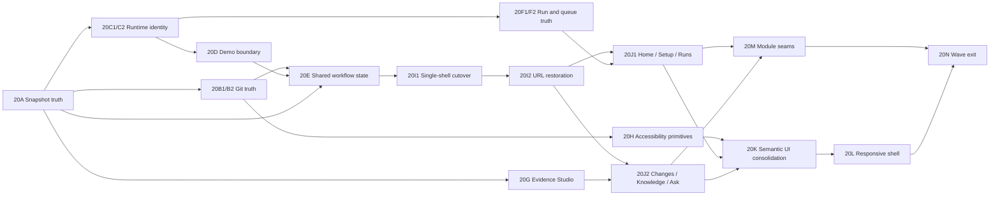

# Architecture Change Review — план переезда на новый UI

Статус: **approved implementation wave plan; product UI not implemented**, 2026-07-15.

Этот документ задаёт порядок доставки Epic 20. Он не создаёт второй backlog и не переименовывает
существующие slice `20A–20N`: [`BACKLOG.md`](BACKLOG.md) остаётся acceptance backlog,
[`PLANS.md`](PLANS.md) — журналом активного slice, а этот файл — decision-complete картой всего
переезда.

До принятия `20I1` продукт использует Console V2. После принятия `20I1` единственной оболочкой
становится `Home / Runs / Knowledge / Changes`; скрытого второго shell и долгоживущего feature flag
не будет.

## 1. Результат wave

После завершения Epic 20 пользователь должен:

1. пройти последовательный Guided Setup и увидеть effective runtime/readiness до запуска;
2. с Home понять состояние workspace, execution, evidence и publication и получить один следующий
   шаг;
3. наблюдать и восстанавливать анализ в Run Studio без глобального шума логов;
4. открыть immutable snapshot выбранного run в Architecture Change Review;
5. читать артефакты через общий Evidence Studio в `Rendered / Raw / Diff`;
6. читать текущую promoted knowledge base в Knowledge/Atlas независимо от active run;
7. использовать Ask как global read-only utility над `Current workspace`;
8. перед Git mutation увидеть полный workspace inventory и подтвердить
   `Commit all workspace changes` либо отдельный demo-вариант.

### Не входит в wave

- hosted/multi-user режим, security/compliance enforcement и запись в source repositories;
- persisted human approval, `Approved` status или approval gate перед runtime promotion;
- selected-file/folder commit, run-to-commit association и per-run `Published` status;
- run-scoped Ask, UI permission broker и semantic architecture diff без нового контракта;
- source-impact planning Epic 21, quick switcher и полный visual rebrand;
- новые headless providers и изменения canonical release matrices/reason taxonomy.

## 2. Правила источников правды

Если документы расходятся, применяется следующий порядок:

1. JSON Schemas и валидаторы определяют artifact/workspace contracts.
2. `docs/spec/*` определяют API, pipeline и workspace behavior.
3. Target design определяет UX, IA, interaction и visual direction.
4. Epic 20 определяет scope, зависимости и acceptance каждого slice.
5. Этот документ определяет delivery order, file/test map и cutover/rollback.
6. README/ARCHITECTURE описывают только уже реализованное поведение.
7. PNG помогают сравнивать композицию и иерархию, но не являются pixel/copy oracle.

Письменная спецификация всегда важнее случайного текста, количества или артефакта генерации на PNG.
План не может переопределить автоматический validator-gated promotion, read-only source repository
boundary или фактический full-workspace `git add -A` contract.

## 3. Канонический reference matrix

### 3.1 Product, behavior и contracts

| Что проверяем | Каноническая ссылка | Как использовать |
| --- | --- | --- |
| Целевой UX/UI | [`UI_ARCHITECTURE_CHANGE_REVIEW_DESIGN.md`](UI_ARCHITECTURE_CHANGE_REVIEW_DESIGN.md) | Jobs, IA, URL state, four-axis model, screen/state inventory, interaction, responsive и accessibility acceptance |
| Scope и зависимости | [`BACKLOG.md` — Epic 20](BACKLOG.md) | Единственные slice ID `20A–20N`, их acceptance и dependency order |
| Активный slice | [`PLANS.md`](PLANS.md) | Один текущий reviewable ExecPlan и factual progress log |
| Runtime pipeline | [`spec/PIPELINE_SPEC.md`](spec/PIPELINE_SPEC.md) | Staging, validator, automatic promotion, read-only inputs и failure semantics |
| HTTP wire contract | [`spec/API_SPEC.md`](spec/API_SPEC.md) | Канонический документированный wire contract; зарегистрированный handler остаётся evidence для ещё не описанного legacy behavior, которое contract-first slice обязан сначала внести в spec |
| Workspace contract | [`spec/WORKSPACE_SPEC.md`](spec/WORKSPACE_SPEC.md), [`workspace.schema.json`](../schemas/workspace.schema.json) | Persisted setup/runtime profile; изменения требуют полного contract sync |
| Run snapshot | [`final-run-index.schema.json`](../schemas/final-run-index.schema.json), [`citation-index.schema.json`](../schemas/citation-index.schema.json) | Run identity, staged document paths, citations и fail-closed evidence reads |
| Schema explanation | [`APPENDIX_SCHEMAS.md`](APPENDIX_SCHEMAS.md) | Human-readable schema map; обновляется вместе со schema/spec slice |
| Implemented shell | [`README.md`](../README.md), [`ARCHITECTURE.md`](ARCHITECTURE.md) | Что реально доступно в текущем binary до принятого cutover |
| Historical V2 | [`UI_CONSOLE_V2_DESIGN.md`](UI_CONSOLE_V2_DESIGN.md) | Traceability и current-shell lineage; не target acceptance |
| Implemented/planned status | [`STAKEHOLDER_DOC.md`](STAKEHOLDER_DOC.md) | Каноническая stakeholder matrix |
| Deterministic QA | [`TESTING_STRATEGY.md`](TESTING_STRATEGY.md) | Required provider-free gates, fixtures, embedded UI bundle policy |
| Trusted release gate | [`RELEASE_LIVE_E2E_RUNBOOK.md`](RELEASE_LIVE_E2E_RUNBOOK.md) | Только pre-release trusted-machine validation после deterministic gates |
| Предыдущий UX evidence | [`ux_current_state_20260707.md`](../reports/ux_current_state_20260707.md), [`ux_ui_assessment_20260708.md`](../reports/ux_ui_assessment_20260708.md) | Проверка, что новый slice закрывает исходную task-level проблему, а не только меняет стиль |
| Repo operating rules | [`AGENTS.md`](../AGENTS.md) | Local-first boundary, contract sync и обязательный DoD |

### 3.2 Reference screens

Все семь экранов используют одну фиктивную Nova Platform fixture. Они задают композицию,
иерархию, density и visual character:

1. [Guided Setup — Runner readiness](assets/ui-architecture-change-review/00-guided-setup-readiness.png)
2. [Home — Needs attention](assets/ui-architecture-change-review/01-home-needs-attention.png)
3. [Runs — Active Run Studio](assets/ui-architecture-change-review/02-run-studio-active.png)
4. [Changes — Architecture Change Review](assets/ui-architecture-change-review/03-change-review-overview.png)
5. [Changes — Evidence Studio](assets/ui-architecture-change-review/04-evidence-studio.png)
6. [Knowledge — Architecture Atlas](assets/ui-architecture-change-review/05-knowledge-atlas.png)
7. [Changes — Publish confirmation](assets/ui-architecture-change-review/06-publish-confirmation.png)

При review реализации сравниваем не координаты пикселей, а:

- порядок title -> source/state -> primary action;
- одну доминирующую рабочую область вместо nested-card grid;
- явную source identity и demo/live identity;
- progressive disclosure diagnostics;
- читабельность evidence и Git scope;
- responsive hierarchy и сохранение task completion.

### 3.3 Внешние interaction references

Проверено по официальной документации 2026-07-15. Эти ссылки не определяют ACP contracts и не
разрешают копировать чужую IA целиком.

| Reference | Что берём | Чего не переносим |
| --- | --- | --- |
| [Temporal Web UI](https://docs.temporal.io/web-ui) | Run identity, execution history, compact/all/raw representations, pending/failure drill-down | Temporal object model и hosted/namespace concepts |
| [Dagster UI reference](https://docs.dagster.io/guides/operate/webserver) | Overview -> Runs -> run details, structured/raw logs, asset catalog и lineage drill-down | Asset materialization semantics и Dagster-specific navigation |
| [GitHub Actions workflow monitoring](https://docs.github.com/en/actions/how-tos/monitor-workflows) | Run graph/status, job/step logs и history/detail separation | GitHub repository/permission surface |
| [GitLab merge request changes](https://docs.gitlab.com/user/project/merge_requests/changes/) | File inventory, tree/list navigation, inline/side-by-side diff, binary/large-file disclosure | MR approval semantics и selected-file publication claims |
| [Grafana Explore](https://grafana.com/docs/grafana/latest/visualizations/explore/) | Focused investigation workbench, inspector/detail modes и URL-shareable context | Query editor/data-source model |
| [Backstage Software Catalog](https://backstage.io/docs/features/software-catalog/) | Entity inventory, ownership/discovery and graph-to-detail navigation | Catalog as source of truth; ACP canonical state remains Git workspace files |
| [WCAG 2.2](https://www.w3.org/TR/WCAG22/) | Reflow, keyboard, focus, target size, status/error and name/role/value acceptance | Формальная conformance claim без отдельного audit |
| [WAI-ARIA Tabs](https://www.w3.org/WAI/ARIA/apg/patterns/tabs/), [Combobox](https://www.w3.org/WAI/ARIA/apg/patterns/combobox/), [Modal dialog](https://www.w3.org/WAI/ARIA/apg/patterns/dialog-modal/) | Keyboard and focus contracts for concrete primitives | ARIA вместо native semantics |
| [MDN History API](https://developer.mozilla.org/en-US/docs/Web/API/History_API/Working_with_the_History_API) | URL/history restoration and `popstate` behavior | Новый routing dependency без доказанной необходимости |

## 4. Зафиксированные результаты sufficiency audit

Проверка текущего кода снимает условность с трёх contract-first PR:

| Решение | Evidence | Следствие |
| --- | --- | --- |
| `20B1` обязателен | `/api/git/diff` не описан в API spec; response не содержит branch/base/HEAD и original path; copy не классифицируется как `copied`, а original path теряется; current UI передаёт `run_id` и тем самым фильтрует inventory, хотя commit использует `git add -A` | Сначала authoritative full inventory contract + backend tests, затем Publish UI |
| `20C1` обязателен | Run history сохраняет `step_providers`, но не process/run `runtime_mode`; desired setup selection может отличаться от effective server process | Persist current effective identity и historical run mode до demo/live UI |
| `20F1` обязателен | Backend имеет один active и один replaceable pending run, но public read model не связывает pending ID/pipeline с active run и supersession rule | Queue control нельзя показывать до authoritative readback |
| `20A` — не schema rewrite | `staged_path`, run identity/containment и run-keyed loading уже частично реализованы | Slice закрывает explicit source mode, atomic snapshot state, fail-closed edges и rendered same-path proof |
| Knowledge graph остаётся bounded | Текущий UI частично выводит graph semantics из file names; отдельного semantic diff contract нет | Knowledge использует validated entities/edges; при недостатке данных показывает list/partial state, без выдуманного graph/change overlay |
| Native History API достаточен для `20I1/I2` | В UI нет router dependency, а route set статичен и мал | `20I1` получает маленький path codec/`popstate`, `20I2` — deep context codec; новый router допустим только после отдельного evidence-backed решения |

Ни один из этих contract PR не меняет schema молча. Изменение public payload синхронизирует
API spec, backend tests, frontend types/fixtures и relevant architecture docs в одном PR.

## 5. Migration architecture

### 5.1 Зависимости



`20H` начинается после честного Publish confirmation primitive и применяется в каждом следующем
slice; accessibility не откладывается до последнего polishing PR.

### 5.2 Target module boundaries

Имена ниже задают ownership, а не требуют массово переместить файлы заранее:

| Target boundary | Текущий вход | Целевой ownership |
| --- | --- | --- |
| `app/navigation` | `App.tsx`, `stageModel.ts`, `StageRail.tsx` | Typed destinations, URL codec/history, route sanitization |
| `app/workflow` | `deriveNextAction`, stage statuses, inspector and Publish gates | One pure four-axis selector, attention queue, primary action and publication gate |
| `shell` | `AppShell`, `TopStatusBar`, `ActiveRunStrip`, `RightInspector`, `ActivityDrawer` | GlobalHeader, PrimaryNav, PageHeader, ContextBar, contextual drawer/modal host |
| `setup` | `OnboardingShell`, workspace/runtime hooks | One-step Guided Setup with persisted summaries and visible blocker |
| `runs` | Analysis part of `StagePanels`, run hooks/log drawer | Runs list, Run Studio, pipeline track, shard matrix, diagnostics drawer |
| `evidence` | raw `<pre>`, Mermaid preview, diff view | Shared ArtifactViewer/Evidence Studio, provenance and source states |
| `changes` | Review + Proposals + Publish parts of `StagePanels` | Review package list, Change Review, findings/proposals/diff/publish modes |
| `knowledge` | Review domain map/artifact explorer | Current workspace Overview/Atlas/Entities/Artifacts with partial/list fallback |
| `ask` | Ask stage-local state | Global `Current workspace · read-only` modal/sheet and citation navigation |
| `publish` | `BaselineGitPanel`, Publish stage, Git hooks | Full inventory, gate, confirmation, attempt-scoped risk acknowledgement and mutation result |

Migration rule для монолитов: новый consumer -> focused tests -> удалить старый consumer в том же
slice. Нельзя сначала создать параллельную копию всей функциональности, а cleanup перенести на конец.

## 6. Delivery phases

Фазы — grouping для coordination. Review/commit единицей остаётся конкретный `20X` или явно
названный `20X1/20X2` из backlog.

### Phase 0 — contract и truth foundation

Порядок:

1. `20A` sufficiency audit и оставшиеся snapshot/source-mode gaps.
2. Параллельно после `20A`: `20B1` Git read contract и `20C1` runtime identity contract.
3. После `20C1`: `20F1` pending/supersession read contract.

Exit:

- два run с одинаковыми canonical paths показывают разные staged bytes;
- snapshot errors не читают current workspace;
- API может вернуть полный Git inventory и branch/base identity;
- current effective и historical runtime identities authoritative;
- active/pending/superseded execution видимы без client inference.

### Phase 1 — shared trust model и interaction primitives

Порядок:

1. `20B2` truthful Publish boundary.
2. `20C2` effective identity UI и restart boundary.
3. `20D` persistent deterministic-demo semantics.
4. `20E` one workflow selector.
5. `20G` Evidence Studio и `20H` critical interaction primitives могут идти параллельно после
   своих foundations.

Exit:

- один selector даёт одинаковые state/next action в будущих Home/Header/Drawer/Changes/Publish;
- fake не выглядит live evidence;
- Git mutation доступна только из Publish и точно называет scope;
- Rendered/Raw/Diff и dialog/tab/combobox semantics готовы к shell composition.

### Phase 2 — single-shell cutover

Порядок:

1. `20I1`: новая IA, minimal Home и path-only codec для `/setup`, `/home`, `/runs`, `/knowledge`,
   `/changes`; direct load и `popstate` работают, но deep run/query context ещё не сохраняется.
2. `20I2`: run/query/artifact/entity codec, Back/Forward/reload restore и missing-ID sanitization.

Cutover gate:

- `/home`, `/runs`, `/knowledge`, `/changes` доступны по прямому URL и не теряют destination при
  Back/Forward;
- все уже реализованные пользовательские задачи остаются достижимыми через честные temporary
  compositions; `/knowledge` до `20J2` может показывать только authoritative current-workspace
  inventory/list или явный partial/unavailable state и не строит filename-derived Atlas;
- Guided Setup остаётся top-level `/setup` до first run;
- old `StageRail` и старые controls не остаются в hidden DOM;
- только новый shell входит в embedded bundle;
- README, ARCHITECTURE, current UI baseline и STAKEHOLDER меняют current-shell status в том же
  `20I1`, а не позже;
- rollback — revert всего `20I1`, а не runtime toggle между двумя shell.

### Phase 3 — destination vertical slices

Порядок:

1. `20F2`: deliberate Run/single-pending controls в Runs и Home.
2. `20J1`: Home + Guided Setup + Runs.
3. `20J2`: Changes + Knowledge + global Ask context.
4. `20M`: Changes/Knowledge/Publish module seams после принятого поведения.

`20F2` должен быть принят до `20J1`, а `20G` — до `20J2`, как зафиксировано в Epic 20. Run Studio
и Evidence Studio могут развиваться параллельно, потому что разделяют только shell/context
primitives, а не domain state.

### Phase 4 — semantic craft, accessibility и responsive

Порядок:

1. Завершить `20H` на всех новых interactive surfaces.
2. `20K`: consolidate уже доказанные tokens/components, не переписывая принятые interactions.
3. `20L`: compact navigation/drawer и first-viewport budget.

Exit:

- visual hierarchy соответствует reference screens и written target;
- no critical axe violations;
- keyboard/focus contracts проходят;
- viewport matrix проходит без document overflow и без потери primary task.

### Phase 5 — rollout и legacy retirement

`20N` обновляет deterministic fixtures, mock/live task assertions, final current-behavior copy и
implementation screenshots. Только здесь удаляются последние legacy stage selectors/tests;
current-shell status уже обязан быть синхронизирован атомарно в `20I1`.

## 7. Slice cards

### `20A` — Run-pinned evidence snapshot truth

Deliverable:

- explicit `Run snapshot / Current workspace` model и URL-ready identity;
- atomic `loading / available / partial / unavailable / error` snapshot transaction;
- fail-closed run ID/path/read validation;
- visible run ID, generated time and source mode.

Expected code:

- `ui/src/lib/appContracts.ts`;
- `ui/src/hooks/useRunArtifacts.ts`, `useRunActions.ts`, `useRunExplorer.ts`;
- Review/Publish evidence context in `App.tsx`/`StagePanels.tsx`;
- focused selector/component tests and named `historical-run-snapshot` mock scenario.

Acceptance: A -> B -> A race, mismatched index, cross-run/out-of-root path, missing indexed file,
optional absent document and stale canonical file all behave exactly as Epic 20 specifies.

### `20B1` — Authoritative full-workspace Git read contract

Deliverable:

- document `GET /api/git/diff` in API spec;
- return full new/modified/deleted/untracked/renamed/copied/changed inventory;
- retain rename/copy old and new paths;
- return branch, base/HEAD identity and a revision/fingerprint usable to invalidate confirmation;
- make binary, unavailable hunk and inventory error explicit.

Fingerprint covers branch/HEAD, normalized path and status, original path, file mode/binary state,
index identity and content hashes for every staged/unstaged/untracked change; counts alone are not
sufficient. Its serialization and hashing algorithm become part of the documented API contract and
have golden backend fixtures.

Expected code/docs:

- `internal/api/review_diff.go`, `internal/api/server_test.go`;
- `docs/spec/API_SPEC.md`, frontend contract/fixtures;
- no schema change unless a persisted artifact is introduced.

Acceptance: inventory without run filtering matches the exact scope covered by `git add -A`.

### `20B2` — Honest Publish boundary

Deliverable:

- `Commit all workspace changes` and distinct demo action;
- complete inventory before enablement;
- separate commit/proposal-branch confirmations;
- no Git mutation in Charter/other destinations;
- attempt-scoped risk acknowledgement reset on inventory/branch/source/question change;
- commit command carries expected inventory fingerprint and expected HEAD OID;
- proposal-branch command carries expected inventory fingerprint, source branch/base and HEAD OID;
- backend serializes the mutation check, recomputes expected state immediately before mutation and
  returns typed `409 stale_git_confirmation` without commit/branch side effects on mismatch.

Expected code:

- `BaselineGitPanel.tsx`, Publish/Charter consumers in `StagePanels.tsx`;
- `useGitActions.ts`, `useGitDiff.ts`, `gitDiffApi.ts`, `workspaceApi.ts`;
- `internal/api/server.go`, serialized Git mutation support and backend mutation tests;
- dialog/focus/component tests.

Acceptance includes inventory change after dialog open, HEAD change, rename/copy change and two
concurrent confirmation attempts; a stale confirmation never reaches `git add -A`, commit or branch
checkout.

### `20C1` — Runtime identity contract

Deliverable:

- current effective runtime/provider/permission readback;
- historical `runtime_mode` plus persisted `step_providers` in run history/status;
- explicit missing legacy metadata behavior.

Expected code/docs:

- `internal/orchestrator` run info/history, API payload and tests;
- `docs/spec/API_SPEC.md`, frontend contracts/fixtures;
- schema/spec/fixture sync if persistence contract changes.

### `20C2` — Desired/effective UI and restart boundary

Deliverable:

- ContextBar/Run Studio use server readback and historical run metadata;
- desired settings shown separately;
- `Pending restart` persists until restarted server confirms values;
- the existing runtime switch is an explicit launcher/first-run Setup exception only while the
  console has not been entered and no active/pending run exists;
- an in-console runtime change remains an explicit Settings-session draft, never calls the
  launcher switch, generates the exact restart command and remains `Pending restart` until a new
  process readback confirms it; reload persistence is not promised without a future persisted
  process-preference contract;
- launcher switch outside that boundary returns typed `409 runtime_switch_requires_restart`.

Expected code:

- `useRuntimeSettings.ts`, runtime display helpers, `TopStatusBar.tsx` migration input,
  Readiness/Run Studio contexts and focused reconnect tests;
- `internal/api/onboarding.go`, `internal/api/server_test.go`, `ui/src/lib/onboardingApi.ts` and
  setup/runtime contract fixtures.

### `20D` — Fake/demo evidence boundary

Deliverable:

- `Deterministic demo` run identity and `Demo evidence` trust state across Runs/Changes/Publish;
- no normal evidence-ready state for fake;
- distinct demo commit confirmation.

Acceptance: fake completes walkthrough but cannot be mistaken for headless/live analysis.

### `20E` — Shared workflow state and publication gate

Deliverable:

- pure typed four-axis selector;
- precedence table for hard blocker -> active/pending -> review risk -> publication;
- one attention queue, status and next action consumed everywhere;
- no permanently disabled Approve actions.

Expected code:

- new focused workflow state module/test;
- migration inputs `stageModel.ts`, `deriveNextAction`, inspector and Publish gate;
- delete each duplicate derivation when its final consumer moves.

Acceptance: table-driven fixtures cannot create a green header with blocked Publish detail.

### `20F1/F2` — Deliberate run and queue semantics

`20F1` exposes authoritative active run identity plus the single replaceable pending run ID,
pipeline and superseded-by identity. It also makes command intent authoritative: an ordinary start
while active returns typed `409 run_active`; only an explicit queue intent may create or replace the
single pending run. Supersession uses a typed `error_code` and `superseded_by_run_id`, never parsing
free-form error text. `20F2` then adds explicit queue confirmation, disables ordinary double-start
and keeps last-good evidence selected after request failure.

Expected code:

- `internal/orchestrator/service_runs.go`, `internal/api/server.go`, run API/tests/spec;
- `useRunActions.ts`, `useRunSelection.ts`, `useRunPolling.ts`;
- current Analysis/ActiveRunStrip as migration inputs, then Runs/Home consumers.

Acceptance includes stale UI/double-click races: a default start cannot silently enqueue, explicit
queue names the pending pipeline, and replacement returns typed identity for the superseded run.

### `20G` — Shared Evidence Studio

Deliverable:

- safe Markdown with headings/lists/tables/code/links and raw HTML disabled;
- Mermaid/YAML-aware rendering;
- consistent `Rendered / Raw / Diff` modes;
- provenance/citations and source badge;
- explicit loading, empty, parse error, unavailable snapshot and bounded large-content states.

Implementation gate: renderer dependency is selected in this slice after license/bundle/security
review. Acceptance forbids raw `dangerouslySetInnerHTML`; package choice is not a product contract.

Expected code:

- shared ArtifactViewer/EvidenceStudio module;
- reuse `MermaidPreview.tsx`, Git diff contract and artifact resolver;
- focused component, XSS, keyboard, long-line and link-routing tests.

### `20H` — Accessibility-critical primitives

Deliverable:

- APG tabs/combobox/modal behavior;
- field error association and restrained live regions;
- modal trap/Escape/focus return; non-modal drawer without trap;
- automated axe test helper and no critical violations;
- reduced-motion, visible focus and contrast roles.

Expected code:

- `TabNav.tsx`, `LocalPathCombobox.tsx`, `AccessibleStatus.tsx`, onboarding forms,
  ConfirmationDialog/ContextDrawer primitives and token styles;
- `ui/e2e/support/accessibilityAssertions.ts` and focused component/mock Playwright coverage;
- `ui/package.json` and `ui/package-lock.json` for the locked axe integration selected by the slice.

### `20I1/I2` — IA cutover and URL context

`20I1` lands the only shell with `Home / Runs / Knowledge / Changes`, visible temporary
compositions and the minimal native History API path codec for `/setup`, `/home`, `/runs`,
`/knowledge`, `/changes`. It owns link navigation, `popstate`, direct-load SPA fallback and same-PR
current-behavior docs. `20I2` adds deep context codec for:

```text
/setup?step=<workspace|sources|brief|runner|review>
/home
/runs
/runs/<run_id>
/knowledge?view=atlas&entity=<entity_id>&source=current
/changes?run=<run_id>&view=<overview|evidence|findings|proposals|diff|publish>&source=snapshot
```

Expected code:

- `App.tsx`, `AppShell.tsx`, `StageRail.tsx`, `stageModel.ts`;
- new navigation/URL module and tests;
- route-level task anchors, Back/Forward/reload and stale-ID sanitization tests;
- `internal/api/server_test.go` direct GET coverage for `/runs/<id>`, `/knowledge?...` and
  `/changes?...` returning the SPA shell rather than 404.

### `20J1` — Home, Guided Setup and Runs

Deliverable:

- attention-first Home with four axes and one next action;
- one-step Guided Setup:
  `Workspace -> Sources -> Analysis brief -> Runner & readiness -> Review & start`;
- explicit `Run without brief` warning;
- Runs list/Run Studio with diagnostics drawer and retained recovery.

Expected code:

- `OnboardingShell.tsx`, current Analysis part of `StagePanels.tsx`;
- run/workspace/runtime hooks;
- new Home/Runs containers and first-run/failed-run focused scenarios.

### `20J2` — Changes, Knowledge and global Ask

Deliverable:

- Changes list routes only successful `init|refresh` snapshots to Change Review;
- failed/canceled/recovered runs lead to Run Studio; QA runs lead to Ask history;
- Change Review composes Overview/Evidence/Findings/Proposals/Diff/Publish;
- Knowledge reads current promoted workspace and uses validated entity/edge sources;
- Atlas always has searchable list/table fallback and visible partial/missing state;
- Ask says `Current workspace · read-only` and becomes a modal/sheet.

Expected code:

- Review/Proposals/Ask/Publish parts of `StagePanels.tsx`;
- run explorer/review/QA hooks and shared Evidence Studio;
- new Changes/Knowledge/Ask containers and task-level tests.

### `20K` — Semantic UI consolidation

Deliverable:

- semantic color/text/surface/border/action/status/focus roles;
- compact type scale, bounded spacing/radius/elevation and density modes;
- consolidate only proven Button/Tabs/PageHeader/ContextBar/Recovery/Metric/Table/Card/Async
  variants;
- keep warm canvas, navy navigation, restrained teal and editorial evidence surfaces.

Expected code: `ConsolePrimitives.tsx`, touched components and token sections of `styles.css`.

### `20L` — Responsive shell and first-viewport budget

Deliverable:

- wide shell, compact 1024 navigation/drawer and mobile bottom navigation;
- full-screen mobile Ask/Evidence/confirmation sheets;
- tables become cards only where comparison is not essential;
- long paths remain copyable without page overflow.

Acceptance viewports:

- `1440x980`, `1280x800`, `1024x768`, `390x844`, plus landscape `844x390`;
- overflow tolerance <= 1px;
- workbench >= 720px at 1024;
- mobile title, source identity, state and primary action above `y=520`;
- pointer targets at least 44px where WCAG target-size expectation applies.

### `20M` — Module seams

Deliverable:

- extract accepted Changes/Knowledge/Publish containers/view models from `StagePanels.tsx`;
- centralize recovery/gate/viewer composition;
- no behavior change beyond already accepted Epic 20 decisions;
- no circular stage dependencies.

### `20N` — Regression gate, docs and rollout

Deliverable:

- canonical fixtures and viewport/a11y task assertions;
- mock Playwright support utilities and migrated live `init-inspect` journey;
- current implementation screenshots;
- README/ARCHITECTURE/TESTING/STAKEHOLDER/current UI baseline sync;
- removal of legacy stage routing/selectors after final consumers are gone.

Required QA contract sync:

- `scripts/ui-mock-e2e.sh` and `scripts/tests/ui_mock_e2e_contract_test.py`;
- `scripts/frontend-live-e2e.sh`, `ui/e2e/live-flow.spec.ts` and
  `scripts/tests/frontend_live_e2e_contract_test.py`;
- `scripts/full-run-batch.sh` and `scripts/tests/batch_failure_classification_test.py` fix the
  fresh-machine Playwright precheck command;
- `ui/playwright.mock.config.ts` and `ui/playwright.live.config.ts` when their project/fixture
  contract changes.

Durable live screenshot names are fixed before selector migration:
`frontend-home-desktop.png`, `frontend-run-studio-desktop.png`,
`frontend-change-review-desktop.png`, `frontend-evidence-studio-desktop.png`,
`frontend-knowledge-desktop.png`, `frontend-publish-desktop.png`,
`frontend-publish-mobile.png` and `frontend-ask-mobile.png`. The `frontend-*.png` prefix keeps each
file inside `frontend-e2e-result.json`; renaming one requires the harness, matching contract test
and current-behavior documentation update in the same slice.

## 8. Current-to-target route map

| Current surface | Target | Migration rule |
| --- | --- | --- |
| Launcher/onboarding | `/setup` | Один текущий step; persisted previous summaries; before first run no primary shell |
| Source | Setup/Settings | Source editing is contextual, not permanent primary destination |
| Readiness | Setup + Settings/Diagnostics | Primary blockers in Setup/Home; expert runtime details disclosed contextually |
| Charter | Setup `brief` | Recommended, explicit skip; no Git mutation |
| Analysis | `/runs` or `/runs/<run_id>` | Mission control becomes Run Studio; logs/permissions stay contextual |
| Review | `/changes?...` plus `/knowledge` | Snapshot decision work goes to Changes; current promoted reading goes to Knowledge |
| Proposals | `/changes?...&view=proposals` | No separate room and no fake approval |
| Ask | global modal/sheet | Current workspace, read-only, not completion step |
| Publish | `/changes?...&view=publish` | Full workspace inventory and confirmation only |
| Domain Map | `/knowledge?view=atlas` | Validated graph plus mandatory list/table fallback |

Browser history restores destination, run, source mode, artifact/entity and viewer mode. Missing ID
is removed with a visible notice; no silent snapshot -> current fallback.

## 9. Canonical state and fixture matrix

Каждый slice добавляет только необходимые rows, но к `20N` матрица должна покрывать:

| Axis | Required states |
| --- | --- |
| Workspace | none, creating/opening, manifest invalid, source invalid, valid, offline/reconnecting |
| Readiness | unknown, checking, provider unavailable, permission/runtime mismatch, pending restart, ready |
| Execution | no run, queued, active, pending replacement, superseded, succeeded, failed, canceled, recovered |
| Evidence | no package, loading, available, partial, optional absent, indexed file missing, corrupt/cross-run, stale response suppressed |
| Identity | fake/demo, headless one provider, headless mixed providers, historical metadata missing |
| Git | clean, dirty, untracked, deleted, renamed, copied, binary, unavailable diff, inventory error, mutation failed/succeeded |
| Review risk | no questions, open questions, proposal missing/blocked, last-good package while new run fails |
| Navigation | valid deep link, Back/Forward, reload, stale run/artifact/entity ID, unsaved draft warning |
| Viewport/input | wide, compact, mobile portrait/landscape, keyboard-only, reduced motion, 200% zoom |

Six named cross-slice fixtures:

1. `two-run-snapshot-isolation`;
2. `dirty-git-outside-selected-preview`;
3. `fake-vs-live-identity`;
4. `desired-vs-effective-runtime`;
5. `active-and-pending-run`;
6. `partial-review-package`.

Canonical physical source: `ui/e2e/support/fixtures/`, with `index.ts` plus one typed module for
each named fixture. Component tests may adapt these fixtures through a shared builder, but endpoint
payloads are not copied into individual specs. The mock runner imports the same modules so the
fixture name in a failure is the name in this plan.

## 10. Test architecture and gates

### 10.1 Stable task anchors

Controls are queried by accessible role/name. `data-testid` remains only for stable page/state
anchors:

- shell: `application-shell`, `primary-nav`, `nav-home`, `nav-runs`, `nav-knowledge`, `nav-changes`;
- shared: `page-header`, `page-state`, `page-primary-action`, `context-drawer`,
  `global-ask-trigger`;
- Setup: `guided-setup`, `setup-progress`, `setup-readiness`;
- Home: `home-page`, `attention-list`, `latest-review-package`;
- Runs: `runs-page`, `run-studio`, `run-status`, `run-source-identity`, `run-history`;
- Knowledge: `knowledge-page`, `knowledge-source-identity`, `architecture-atlas`,
  `architecture-entity-list`;
- Changes: `changes-page`, `change-review`, `review-source-identity`, `review-queue`,
  `evidence-studio`, `artifact-viewer`;
- Publish: `publish-page`, `git-change-inventory`, `publish-gate`, `publish-confirm-dialog`;
- Ask: `ask-dialog`, `ask-context`, `ask-history`, `ask-answer`.

Hidden compatibility controls запрещены.

### 10.2 Per-PR gate

Fresh-machine prerequisite:

```bash
./scripts/run-npm.sh ci --prefix ui
./scripts/run-npm.sh exec --prefix ui -- playwright install chromium
```

Разделитель `--` обязателен: без него npm разбирает `playwright` как собственный аргумент, а не
запускает project binary. `20N` синхронизирует ту же команду в `scripts/full-run-batch.sh` до
использования migrated live journey.

Минимум для каждого UI slice, включая provider-free mock journey:

```bash
./scripts/run-npm.sh run test --prefix ui -- --run
./scripts/run-npm.sh run typecheck --prefix ui
./scripts/run-npm.sh run build --prefix ui
./scripts/run-npm.sh run e2e:mock --prefix ui
```

Добавление/удаление mock scenario синхронно обновляет
`scripts/tests/ui_mock_e2e_contract_test.py`; текущая проверка фиксирует точное количество scenarios.
Shared API mock регистрирует каждый ожидаемый `method + path`, накапливает unmatched requests и
завершает test ошибкой при любом незаявленном endpoint. Универсальный successful fallback вроде
`{ok: true, ignored: true}` запрещён.

Каждый завершённый slice выполняет repository DoD:

```bash
make contracts
make test
make lint
make build
```

Для любого UI diff дополнительно:

```bash
bash scripts/verify-ui-deterministic-build.sh WORKTREE
```

`make verify-ui-determinism` проверяет `HEAD`, поэтому выполняется после commit или на проверяемом
commit в CI. `internal/api/ui_dist` версионируется; порядок подготовки change set фиксирован:

1. `make build` пересобирает source UI и embedded bundle;
2. regenerated `internal/api/ui_dist` просматривается и включается в тот же staged change set;
3. `make verify-ui-dist` доказывает отсутствие unstaged расхождения bundle;
4. после commit выполняется `make verify-ui-determinism`.

Source UI без свежего embedded bundle не принят.

### 10.3 Wave-exit deterministic gate

- все unit/component/API tests;
- provider-free mock Playwright без skipped scenarios, console errors и unexpected API failures;
- six named fixtures;
- axe gate без critical violations;
- full viewport matrix и 200% zoom/reflow check;
- keyboard-only Setup, recovery, Evidence Studio, Ask и Publish;
- URL Back/Forward/reload restoration;
- full DoD, UI determinism и embedded bundle freshness.

Viewport gate реализуется в `ui/e2e/responsive-shell-mock.spec.ts`: один deterministic scenario
проходит все пять canonical размеров и проверяет document overflow, 1024 workbench width и mobile
first-viewport anchors. Reflow at 200% проверяется как эквивалентный `640x400` CSS viewport для
desktop width `1280x800`; keyboard task должен оставаться выполнимым без горизонтальной прокрутки
страницы. Отдельная ручная Chromium zoom-проверка может дополнять, но не заменять этот executable
gate.

UI coverage остаётся informational в этом wave. Threshold/ratchet требует отдельного согласованного
slice с одновременным изменением config, contract test и testing strategy; migration не вводит его
скрыто.

### 10.4 Live/release boundary

Required CI остаётся network-free и не зависит от provider CLIs. После deterministic wave exit
live `init-inspect` меняет только UI journey/selectors/screenshots, сохраняя существующую reason
taxonomy и snapshot frontend workspace.

Pre-release gate запускается только по
[`RELEASE_LIVE_E2E_RUNBOOK.md`](RELEASE_LIVE_E2E_RUNBOOK.md) и skill `acp-e2e-live-gate`:

- только `scripts/full-run-batch-matrix.sh`;
- canonical `baseline + parallel-default` sweeps;
- все release providers `qwen`, `claude`, `codex` в PATH;
- strict zero-failure;
- clean committed tree и clean worktree на trusted host;
- `artifact_source=snapshot` и frontend `init-inspect=passed` для `qwen`, `claude`, `codex`;
- одинаковый shard-plan одного `profile_id` в `baseline` и `parallel-default`;
- никакого diagnostic timeout override в release evidence;
- `reports/release_verdict_<matrix-id>.json` = `PASS`;
- matching accepted SWE UX и artifact-quality assessments.

Machine verdict после завершения matrix проверяется только командой:

```bash
python3 scripts/verify-release-verdict.py reports/release_verdict_<matrix-id>.json
```

Live provider execution не является merge gate обычного UI slice.

## 11. Rollout, cutover и rollback

### До `20I1`

- Console V2 — единственный shell;
- foundations подключаются к current consumers только там, где это уже truthful улучшение;
- URL target routes не рекламируются как implemented.

### В `20I1`

- все четыре path destination должны быть direct-loadable через visible temporary compositions;
- все существующие tasks остаются достижимы, но `/knowledge` может честно оставаться
  partial/unavailable до `20J2` и не имитирует semantic Atlas;
- новая оболочка заменяет старую атомарно;
- temporary composition может использовать старый container, но не старую stage navigation;
- нет hidden rail/buttons/test DOM и нет dual-shell runtime flag;
- README, ARCHITECTURE, current UI baseline и STAKEHOLDER синхронно называют новый shell current.

### После `20I1`

- каждый vertical slice заменяет один temporary composition и удаляет его old consumer в том же PR;
- rollback выполняется revert конкретного slice/embedded binary;
- public payload changes остаются additive/backward-compatible до удаления legacy consumer;
- нет data migration state: workspace files и run history остаются authoritative и Git-friendly.

Prepared commit message, route/source selection и unsaved drafts не должны теряться при ordinary
reconnect. Reload persistence обещается только для URL context и уже сохранённых workspace values.

## 12. Documentation sync per slice

| Изменение | Обязательная синхронизация |
| --- | --- |
| API payload | `docs/spec/API_SPEC.md`, Go handler tests, frontend contracts/fixtures, ARCHITECTURE if boundary changes |
| Schema/artifact contract | schema, spec, appendix, examples, fixtures, validators/tests и ADR rationale |
| Implemented navigation/behavior | README, ARCHITECTURE, current UI baseline, STAKEHOLDER matrix, TESTING_STRATEGY/E2E contracts |
| Visual implementation | Target design remains planned baseline; implementation screenshots update only after accepted behavior |
| Active progress | One slice ExecPlan in PLANS with evidence and exact commands/results |
| Live UI journey/selectors | `20N` синхронно обновляет UI steps и screenshots в `RELEASE_LIVE_E2E_RUNBOOK.md`, live spec и contract test до pre-release |
| Release policy/taxonomy/matrices | Только отдельный approved release-gate slice; UI wave не меняет profile taxonomy, reason taxonomy, canonical matrices или curated repos, чтобы пройти локально |

Status language is strict:

- `planned` — written target only;
- `in progress` — active slice, not product capability;
- `implemented` — code, tests, embedded bundle and behavior docs accepted;
- `release validated` — separate trusted-machine evidence accepted.

## 13. Decisions deferred outside this wave

Эти вопросы не блокируют Epic 20 и не должны решаться UI-only предположением:

- semantic comparison baseline и entity/edge/finding diff contract;
- exact required proposal package contract;
- provider outage policy для publication already-valid evidence;
- persisted review decisions;
- run-to-commit publication association;
- selected-file commit;
- run-scoped Ask;
- permission approve/deny broker;
- source-impact planning.

До появления contracts UI показывает artifact/Git-level truth, `Unknown` и explicit partial states.

## 14. Wave exit checklist

- [ ] `20A–20N` acceptance закрыты и каждый slice имеет собственные focused tests.
- [ ] Единственная IA — `Home / Runs / Knowledge / Changes`; Setup contextual, Ask global.
- [ ] Snapshot/current, effective/desired, demo/live и evidence/publication contexts не смешиваются.
- [ ] Run Studio сохраняет active/pending/recovery semantics без double-start.
- [ ] Evidence Studio используется Changes, Knowledge, Ask citations и Publish preview.
- [ ] Knowledge/Atlas не выдаёт filename heuristic или визуальное расположение за architecture fact.
- [ ] Publish inventory точно соответствует full-workspace mutation; Git controls отсутствуют вне Publish.
- [ ] Back/Forward/reload восстанавливают валидный context и fail visibly on stale IDs.
- [ ] Six canonical fixtures, axe и viewport matrix проходят.
- [ ] Full DoD, UI determinism и embedded bundle freshness проходят.
- [ ] README/ARCHITECTURE/TESTING/STAKEHOLDER/current baseline описывают новый implemented shell.
- [ ] Live `init-inspect` мигрирован без изменения release taxonomy; pre-release evidence принято отдельно.
- [ ] Legacy `StageRail`, stage routing, misleading copy и hidden compatibility selectors удалены.

## 15. Первый implementation slice

Начинать с существующего `20A`, не с shell или visual tokens:

1. зафиксировать landed snapshot behavior focused tests;
2. добавить explicit source view model;
3. сделать один run-keyed atomic load и fail-closed error taxonomy;
4. вывести source identity в current Review/Publish context;
5. добавить rendered same-path two-run scenario;
6. пройти focused checks, full DoD, UI determinism и embedded bundle verification;
7. только после принятия `20A` открыть параллельные `20B1` и `20C1`.

Такой первый slice даёт наблюдаемую trust-функцию в текущем UI и одновременно создаёт foundation
для Changes/Knowledge без преждевременного shell cutover.
