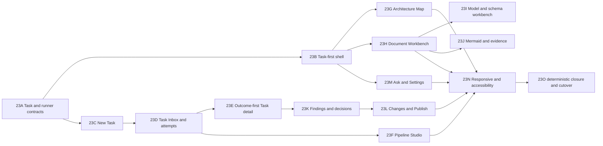

# Task-first Product UI — migration plan

Статус: **planned implementation wave**, 2026-08-11.

Целевой UX зафиксирован в [`UI_TASK_FIRST_PRODUCT_DESIGN.md`](UI_TASK_FIRST_PRODUCT_DESIGN.md).
Epic 23 в [`BACKLOG.md`](BACKLOG.md) является acceptance backlog. Этот документ задаёт dependency
order, review boundaries, test ownership и cutover policy.

## 1. Goal

Заменить текущий `Home / Analyze / Architecture / Changes` shell на task-first product без второго
скрытого UI, сохранив local-first, immutable run evidence, validator-gated promotion, current
Architecture authority и full-workspace Git publication.

## 2. Non-goals

- big-bang frontend rewrite;
- изменение runtime pipeline ради удобного mock UI;
- local-only Task façade без persisted contract;
- schema/API changes внутри visual slice;
- сохранение старых routes/selectors через hidden compatibility DOM;
- release/live-gate expansion до deterministic UI closure.

## 3. Source-of-truth order

1. `schemas/*` и validators.
2. `docs/spec/*` runtime/API/workspace behavior.
3. `UI_TASK_FIRST_PRODUCT_DESIGN.md` UX, IA, file workbench и states.
4. Epic 23 acceptance.
5. Этот migration plan.
6. PNG composition references.

При конфликте PNG не может переопределить automatic promotion, evidence authority, full-workspace
Git scope или read-only source repository boundary.

## 4. Required contract decisions before shell cutover

### 4.1 Task persistence

Нужно определить public shape и storage для:

- `task_id`, title, goal/context;
- repository/scope selection;
- runner preset reference и immutable effective Attempt snapshot;
- attempts/parent-child lineage;
- result/review/publication linkage;
- created/updated/archived lifecycle.

Contract должен быть Git/local-first compatible, но Task history не должна загрязнять promoted
Architecture или анализируемые repositories. Schema-first slice синхронизирует spec, schema,
validators, fixtures, API and examples.

### 4.2 Runner admission

Нужно решить, является ли fake/headless mode:

- per-Attempt admission config; либо
- immutable service-session mode с честным restart/re-attach flow.

Target UX предпочитает per-Attempt snapshot. До backend поддержки frontend показывает реальное
ограничение и не имитирует seamless switch. Per-step providers и provider model/effort остаются
workspace profile inputs и копируются в Attempt snapshot.

### 4.3 Task-to-change/publication identity

Current workspace promotion остаётся automatic. Task outcome может ссылаться на semantic promoted
snapshot/run comparison, но `Published` нельзя выводить без authoritative task/run-to-commit
association. До такого контракта UI использует `Workspace has unpublished changes`.

## 5. Delivery order

`23A` может быть разделён на contract-only PRs, если Task и runner admission затрагивают разные
schemas. Остальные slices не должны начинать с invented frontend types.

## 6. Target module ownership

| Boundary | Responsibility | Existing inputs to reuse |
| --- | --- | --- |
| `features/tasks` | Task list, composer, detail, attempts, outcome | run selection/polling/actions and coordination hooks |
| `features/runners` | presets, readiness, effective snapshot | runtime profile/settings, doctor and provider guidance |
| `features/attempts` | Pipeline Studio, progress, recovery, diagnostics | analysis view models, run logs, retry planner |
| `features/architecture` | map, documents, model, findings | Architecture API, KnowledgePage and map components |
| `features/documents` | Markdown/YAML/JSON/Mermaid workbench | EvidenceViewer, MermaidPreview, artifact APIs |
| `features/changes` | semantic summary, evidence, file diff, Publish | current ChangesWorkspace and git diff flow |
| `features/ask` | global current-workspace Ask | async QA run APIs and current Ask panel |
| `app/navigation` | typed routes/history/stale identity | current route codec and workflow destinations |
| `ui/primitives` | buttons, tabs, badges, split panes, drawers, editors | SemanticPrimitives and ContextDrawer |

`App.tsx` остаётся orchestration shell только до того момента, когда touched vertical slices
получают container/hook ownership. Не выполнять массовый перенос unrelated state.

## 7. Vertical slice definition

Каждый slice обязан включать:

1. contract/view-model decision;
2. one complete user job;
3. loading/empty/error/partial/disabled/success states;
4. keyboard/focus behavior;
5. component tests;
6. one rendered desktop and one mobile fixture;
7. selector/docs migration;
8. no stale old screen left in reachable navigation.

## 8. File-workbench implementation constraints

### Markdown

- reuse safe renderer and link containment;
- introduce document outline and citation drawer without changing artifact authority;
- editor/save is separate from reader; read-only snapshot cannot import mutation controls;
- large/render-error fallback has bounded source mode.

### YAML/JSON

- schema registry maps known content types to intentional inspectors;
- structured editing is disabled until lossless patch/write behavior is proven;
- schema and semantic diagnostics share one stable issue model;
- fixtures cover comments, unknown keys, ordering, multiline scalars and invalid input.

### Mermaid

- renderer and source mode share exact selected artifact identity;
- entity navigation derives from validated semantic IDs, not layout labels;
- accessible list/table alternative is required before map-only cutover;
- source diff is canonical; no visual-diff claim.

## 9. Test strategy

### Contract and backend

- schema validation and round-trip fixtures for Task/Attempt/runner snapshot;
- restart/history persistence and parent-child retry lineage;
- concurrent start/session switch/admission lease tests;
- task/run/snapshot/commit identity tests;
- read-only source and workspace path containment regressions.

### Frontend unit/component

- route table and Back/Forward restoration;
- task grouping/filtering and selected identity;
- runner readiness and immutable active Attempt behavior;
- terminal outcome never renders active language;
- artifact authority and edit permissions;
- Markdown/YAML/Mermaid state matrices;
- full-workspace Publish confirmation and stale state.

### Rendered mock E2E

Required deterministic scenarios:

1. blank setup -> demo Task -> result;
2. live runner unavailable -> choose demo without losing draft;
3. running Task -> Pipeline Studio -> retrying scope;
4. terminal failed Attempt with retained last-good Architecture;
5. Markdown read/edit/validate/save -> Git dirty;
6. invalid YAML structured/source recovery;
7. Mermaid render failure fallback;
8. finding -> evidence -> source path -> return focus;
9. semantic Changes -> full Git inventory -> commit confirmation;
10. Ask failure/retry and explicit proposal draft.

Every scenario runs at `1440x980`, `1024x768`, `390x844`, checks global overflow, console errors,
critical axe violations and screenshot artifacts on failure.

### Closure

- narrow slice checks during work;
- full DoD: `make contracts`, `make test`, `make lint`, `make build`;
- deterministic mock E2E and embedded UI parity;
- live provider gate only after `23O` and only through canonical runbook.

## 10. Cutover and cleanup

- Cut over primary navigation only when Tasks, Architecture and Changes all have truthful target
  containers.
- `/runs` may redirect to `/tasks` only after Task/run identity migration exists.
- Remove Home and Analyze components/routes/selectors in the same accepted cutover slice; do not
  keep hidden equivalents.
- Old design assets `ui-console-v2`, `ui-architecture-change-review` and `ui-product-shell` are
  removed in the design-baseline slice and are not test fixtures.
- Current-behavior screenshots remain ephemeral E2E artifacts, not committed target references.
- Update README/ARCHITECTURE/STAKEHOLDER only when implemented status changes; target links may be
  present earlier when explicitly labelled planned.

## 11. Wave acceptance

- Tasks is the stable default object and Attempt is execution detail.
- Ordinary runner choice is adjacent to Start Task.
- Terminal success is outcome-first; recovery is one click deeper.
- Architecture reads current validated knowledge independent of Task execution.
- Markdown/YAML/Mermaid use content-appropriate readers and honest edit permissions.
- Changes describes already promoted knowledge; Publish describes full workspace Git mutation.
- All target states and viewports pass deterministic tests.
- No obsolete UI screenshots, target docs, navigation or hidden compatibility shell remains.
